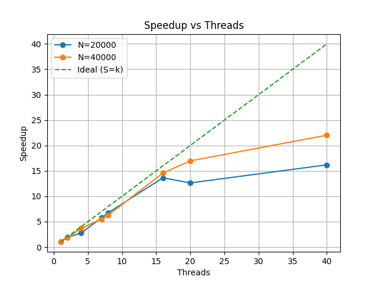
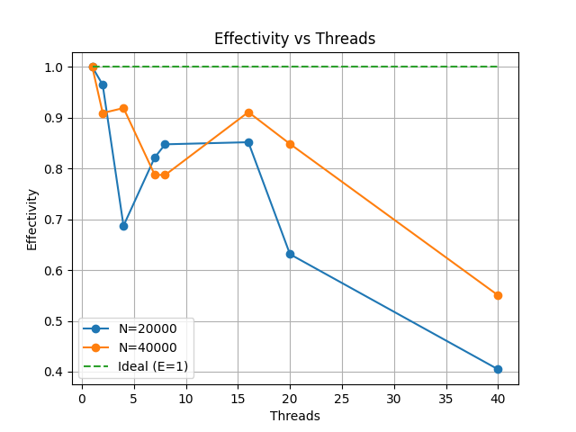
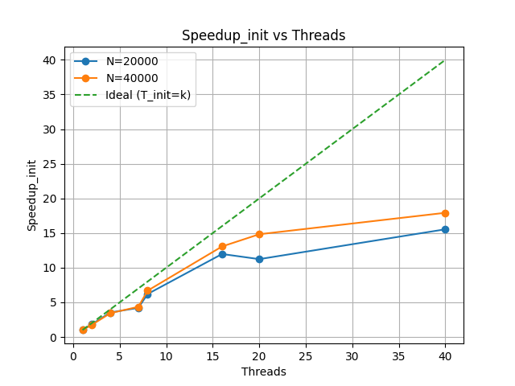

# Описание вычислительного узла

## Сервер
**Наименование:** ProLiant XL270d Gen10

---

## CPU

- **Архитектура:** x86_64  
- **Процессоры:** 2 × Intel Xeon Gold 6248  
- **Физические ядра:** 40 (20 на сокет)  
- **Логические потоки:** 80 (2 потока на ядро)  
- **Максимальная частота:** до 3.9 ГГц  
- **Кэш L3:** 55 МБ (общий)  

---

## NUMA

- **Количество NUMA узлов:** 2 (nodes 0–1)  
- **node 0 память:** 385636 MB (~377 ГБ)  
- **node 1 память:** 387008 MB (~378 ГБ)  

---

## Операционная система

- Ubuntu 22.04.5 LTS

  
  

# Отчёт по OpenMP task1

## График ускорения

## График Эффективности

## График Скорости инициализации 

## Выводы

1. При увеличении числа потоков наблюдается рост ускорения, близкий к линейному до ~16–20 потоков.

2. Максимальная эффективность достигается при среднем числе потоков(1-16) и составляет ~0.8–0.9.

3. При дальнейшем увеличении числа потоков эффективность снижается, что связано с накладными расходами параллелизма, конкуренцией за ресурсы.

4. При увеличении размера задачи (N) наблюдается улучшение масштабируемости, так как уменьшается относительное влияние накладных расходов.

