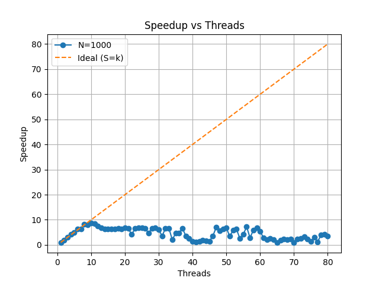
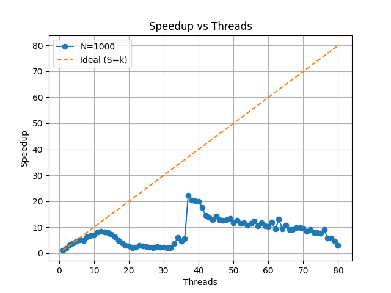
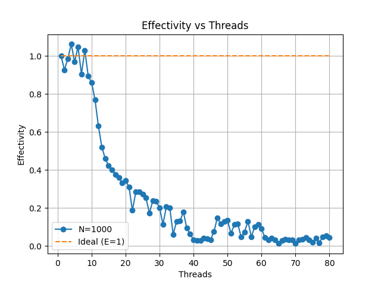
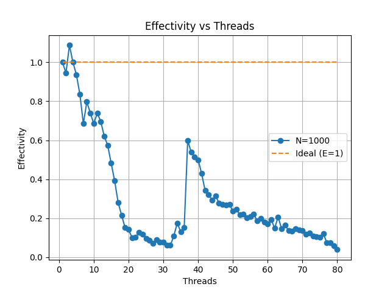

## Итоги о целесообразности использования omp parallel

## График ускорения
### omp parallel for

### omp parallel 

## График Эффективности
### omp parallel for

### omp parallel 

## Вывод:

В большинстве случаев директива #pragma omp parallel for является более эффективной по сравнению с использованием #pragma omp parallel с ручной организацией распределения вычислений, поскольку она обеспечивает автоматическое распределение итераций цикла между потоками с меньшими накладными расходами и без необходимости явной синхронизации.

Однако по результатам эксперимента при размере задачи N=1000 наблюдается, что вариант с omp parallel демонстрирует сопоставимое или более высокое ускорение и эффективность по сравнению с omp parallel for.

Это может быть связано с тем, что при относительно небольших размерах задачи накладные расходы на организацию параллелизма, синхронизацию потоков и распределение нагрузки начинают оказывать значительное влияние на общее время выполнения. В таких условиях различия между подходами могут нивелироваться, а эффективность выполнения определяется особенностями конкретной реализации, кэширования и планирования потоков.

Таким образом, можно сделать вывод, что:

- `omp parallel for` является предпочтительным решением для задач с большим объёмом вычислений и независимыми итерациями;
- использование `omp parallel` может быть оправдано в итерационных алгоритмах с межитерационной зависимостью данных, несмотря на потенциально большие накладные расходы;
- при малых размерах задачи различия между подходами могут быть незначительными или зависеть от особенностей архитектуры и реализации.